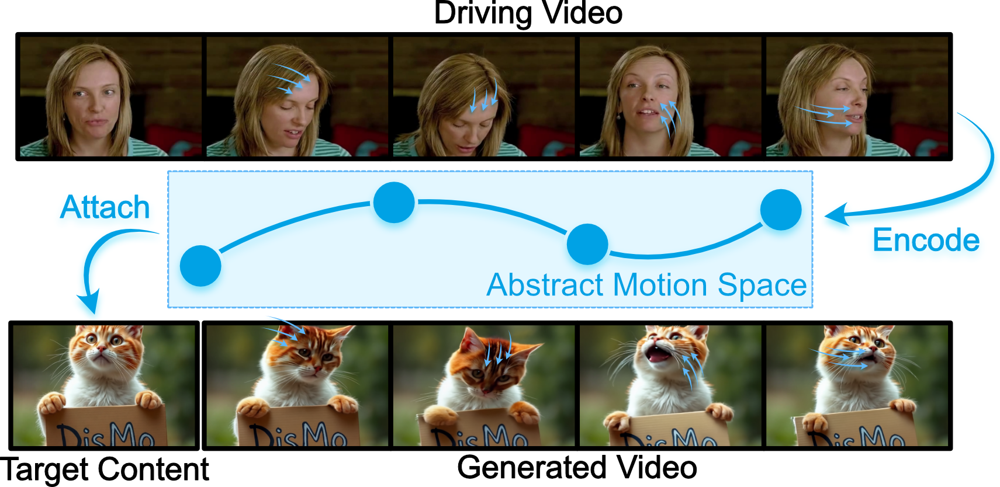

[](https://compvis.github.io/flow-poke-transformer/)
[](https://arxiv.org/abs/2510.12777)
[](https://huggingface.co/CompVis/flow-poke-transformer)
<h2 align="center"><i>DisMo</i>: Disentangled Motion Representations for Open-World Motion Transfer</h2>
<div align="center"> 
  <a href="https://www.linkedin.com/in/thomas-ressler-494758133/" target="_blank">Thomas Ressler-Antal</a> · 
  <a href="https://ffundel.de/" target="_blank">Frank Fundel</a><sup>*</sup> · 
  <a href="https://www.linkedin.com/in/malek-ben-alaya/" target="_blank">Malek Ben Alaya</a><sup>*</sup>
  <br>
  <a href="https://stefan-baumann.eu/" target="_blank">Stefan A. Baumann</a> · 
  <a href="https://www.linkedin.com/in/felixmkrause/" target="_blank">Felix Krause</a> · 
  <a href="https://www.linkedin.com/in/ming-gui-87b76a16b/" target="_blank">Ming Gui</a> · 
  <a href="https://ommer-lab.com/people/ommer/" target="_blank">Björn Ommer</a>
</div>
<p align="center"> 
  <b>CompVis @ LMU Munich, MCML</b>
  <br/>
  <i>* equal contribution</i>
  <br/>
  NeurIPS 2025 Spotlight
</p>



<i>DisMo</i> learns an abstract motion representation space from open-world videos that is invariant to static content information by utilizing an image-space reconstruction objective. This invariance is leveraged for motion transfer by fine-tuning a pre-trained video model conditioned on this motion representation. 

This codebase is a minimal PyTorch implementation covering training & various inference settings.

## 🚀 Usage
To use DisMo for motion transfer purposes, we provide a fine-tuned CogVideoX-5B video model, which internally uses a pre-trained motion extrator module. Simply instantiate it and load the provided checkpoint. Please make sure to also provide a valid motion extractor checkpoint path:
```
from dismo.video_model_finetuning.cogvideox import CogVideoXMotionAdapter_5B_TI2V_Large

ckpt = torch.load("/path/to/finetuned/cogvideox/checkpoint")
missing, unexpected = cog.load_state_dict(ckpt, strict=False) # Required since we only provide LoRA weights
assert len(missing) == 0

cogvideox = CogVideoXMotionAdapter_5B_TI2V_Large(
    motion_extractor_ckpt_path="/path/to/motion_extractor/checkpoint",
    vae_slicing=True, # reduces VRAM
    vae_tiling=True, # reduces VRAM
)
cogvideox.eval()
cogvideox.requires_grad_(False)
cogvideox.to(device)

```
Afterwards you can use the model's `sample` function by providing a batch of driving videos from which motion will be extracted from, and corresponding target images, and text prompts, onto which the extracted motion will be applied to:
```
gen_videos = cogvideox.sample(
    motion_videos=driving_videos,
    images=target_images,
    prompts=target_prompts,
)
```
Please have a look in the code for the other parameters this function provides (e.g., classifier-free guidance).

### Motion Embedding Extraction
If you want to use DisMo for extracting motion embeddings from videos for purposes other than motion transfer, you can also just load the pre-trained motion extractor on its own. Simply instantiate the module and load the checkpoint as follows:
```
from dismo.model import MotionExtractor_Large
motion_extractor = MotionExtractor_Large()
motion_extractor.load_state_dict(
    torch.load("/path/to/motion_extractor/checkpoint")
)
motion_extractor.eval()
motion_extractor.requires_grad_(False)
motion_extractor.to(device)
```
You may then use the module's `forward_sliding` function to extract motion embeddings from arbitrarily long videos:
```
import torch
video = torch.rand((B, num_frames, 256, 256, 3)).mul(255).byte()
motion_embeddings = motion_extractor.forward_sliding(video) # [B, num_frames - max_prediction_distance, D]
```
Note that the resulting motion embeddings have a temporal length of `num_frames - max_prediction_distance`, with `max_prediction_distance` being the maximum possible distance between a source and target frame during training.


## 🔥 Training
You can also train DisMo yourself using your own video dataset.

**Data Preparation**
DisMo only needs unlabelled videos for training. This repository takes advantage of the [webdataset](https://github.com/webdataset/webdataset) library and format for efficient and scalable data loading. Please refer to their page for further instructions on how to shard your video dataset accordingly.

**Launching Training**
Single-GPU training can be launched via
```shell
python train.py --data_tar_base /path/to/preprocessed/shards --out_dir output/test --compile True
```
Similarly, multi-GPU training, e.g., on 2 GPUs, can be launched using torchrun:
```shell
torchrun --nnodes 1 --nproc-per-node 2 train.py [...]
```
Training can be continued from a previous checkpoint by specifying, e.g., `--load_checkpoint output/test/checkpoints/checkpoint_0100000.pt`.
Remove `--compile True` for significantly faster startup time at the cost of slower training & significantly increased VRAM usage.


## Models
We release the weights of our pre-trained motion extractor and the LoRA weight of a fine-tuned CogVideoX-5B via huggingface at https://huggingface.co/CompVis (under the [CC BY-NC 4.0](https://creativecommons.org/licenses/by-nc/4.0/deed.en) license), and will potentially release further variants (scaled up or with other improvements). Due to legal concerns, we do not release the weights of the frame generator that was trained alongside the motion extractor.

## Code Credit
- Some code is adapted from [flow-poke-transformer](https://github.com/CompVis/flow-poke-transformer) by Stefan A. Baumann et al. (LMU), which in turn adapts some code from  [k-diffusion](https://github.com/crowsonkb/k-diffusion) by Katherine Crowson (MIT)
- The CogVideoX finetuning code is adapted from [CogKit](https://github.com/THUDM/CogKit) (Apache 2.0)
- The DINOv2 code is adapted from [minDinoV2](https://github.com/cloneofsimo/minDinoV2) by Simo Ryu, which is based on the [official implementation](https://github.com/facebookresearch/dinov2/) by Oquab et al. (Apache 2.0)

## 🎓 Citation
If you find our work useful, please cite our paper:
```bibtex
@inproceedings{resslerdismo,
  title={DisMo: Disentangled Motion Representations for Open-World Motion Transfer},
  author={Ressler-Antal, Thomas and Fundel, Frank and Alaya, Malek Ben and Baumann, Stefan Andreas and Krause, Felix and Gui, Ming and Ommer, Bj{\"o}rn},
  booktitle={The Thirty-ninth Annual Conference on Neural Information Processing Systems},
  year={2025}
}
```
